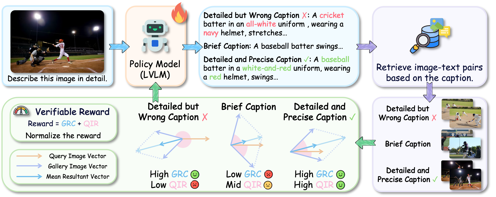

# Cross-modal Identity Mapping (CIM)

**Minimizing Information Loss in Modality Conversion via Reinforcement Learning**

*IEEE/CVF Conference on Computer Vision and Pattern Recognition (CVPR), 2026.*

[](https://arxiv.org/abs/2603.01696)
[](https://huggingface.co/collections/kkk5/cim-69f0aaa010095c497b781f8e)

## News

* **`2026.06`** We released the training code and model weights for CIM.

## Introduction

Large Vision-Language Models (LVLMs) frequently omit or misrepresent visual content in image captions. We observe that caption quality correlates with the similarity between images retrieved via text search using that caption. Based on this insight, we propose **Cross-modal Identity Mapping (CIM)**, a reinforcement learning framework for improving image captioning without extra annotations.

CIM evaluates information loss through two reward signals:

- **Gallery Representation Consistency (GRC)** — measures whether the generated caption retrieves images whose representations are consistent with the gallery.
- **Query-gallery Image Relevance (QIR)** — measures the relevance between the query image and the images retrieved by the caption.

Under these rewards, the LVLM minimizes information loss and aims to achieve identity mapping from images to captions. Experiments show that CIM outperforms Supervised Fine-Tuning, achieving a **20% improvement in relation reasoning** on the COCO-LN500 benchmark with Qwen2.5-VL-7B.

<p align="center">
    
</p>

## Model Zoo

All model weights are available on [Hugging Face](https://huggingface.co/collections/kkk5/cim-69f0aaa010095c497b781f8e):

| Model | Base Model | Training | HuggingFace |
|:------|:-----------|:---------|:------------|
| CIM-Qwen2-VL-7B | Qwen2-VL-7B-Instruct | GRPO | [kkk5/CIM-Qwen2-VL-7B](https://huggingface.co/kkk5/CIM-Qwen2-VL-7B) |
| CIM-Qwen2.5-VL-7B | Qwen2.5-VL-7B-Instruct | GRPO | [kkk5/CIM-Qwen2.5-VL-7B](https://huggingface.co/kkk5/CIM-Qwen2.5-VL-7B) |
| CIM-LLaVA1.5-7B | LLaVA-1.5-7B | GRPO | [kkk5/CIM-LLaVA1.5-7B](https://huggingface.co/kkk5/CIM-LLaVA1.5-7B) |
| CIM-InternVL2-8B | InternVL2-8B | GRPO | [kkk5/CIM-InternVL2-8B](https://huggingface.co/kkk5/CIM-InternVL2-8B) |
| CIM-InternVL2.5-8B | InternVL2.5-8B | GRPO | [kkk5/CIM-InternVL2.5-8B](https://huggingface.co/kkk5/CIM-InternVL2.5-8B) |
| CIM-InternVL3-8B | InternVL3-8B | GRPO | [kkk5/CIM-InternVL3-8B](https://huggingface.co/kkk5/CIM-InternVL3-8B) |
| CIM-Qwen2-VL-7B-SFT | Qwen2-VL-7B-Instruct | SFT + GRPO | [kkk5/CIM-Qwen2-VL-7B-SFT](https://huggingface.co/kkk5/CIM-Qwen2-VL-7B-SFT) |
| CIM-LLaVA1.5-7B-SFT | LLaVA-1.5-7B | SFT + GRPO | [kkk5/CIM-LLaVA1.5-7B-SFT](https://huggingface.co/kkk5/CIM-LLaVA1.5-7B-SFT) |

## Installation

```bash
git clone https://github.com/Jia-hn/CIM.git
cd CIM
conda create -n cim python=3.10
conda activate cim
pip install -r requirements.txt
```

> **Note:** `flash-attn` may require separate installation depending on your CUDA version:
> ```bash
> pip install flash-attn --no-build-isolation
> ```

## Data Preparation

### 1. Download Images

Download images from the following sources and place them under the `data/` directory:

- [COCO](https://cocodataset.org/#download)
- [DOCCI](https://google.github.io/docci/)

### 2. Download Labels and Gallery Data

- **Training & evaluation labels:** download from [SC-Captioner-data](https://huggingface.co/datasets/zl2048/SC-Captioner-data/tree/main) and place under `data/`
- **Gallery images and metadata:** download from [DenseFusion-1M](https://huggingface.co/datasets/BAAI/DenseFusion-1M/tree/main) and place under `data/`

Update the image paths in the json files to match your local directory structure.

### 3. Data Preprocessing

Generate RL training data format:
```bash
python preprocess/data.py        # for Qwen and InternVL
python preprocess/data_llava.py  # for LLaVA
```

Generate gallery embeddings for the reward server:
```bash
python preprocess/embedding_coco6k_caption.py
python preprocess/embedding_coco6k_image.py
python preprocess/embedding_densefusion_caption.py
torchrun --nproc_per_node=8 preprocess/embedding_densefusion_image.py
```

## Training

Each script automatically starts the CIM reward server, runs GRPO training, and performs evaluation. Training requires **8 GPUs**.

```bash
# Qwen2-VL-7B
bash rl_qwen2_vl/scripts/coco6k_qwen2_vl_7b_grpo.sh

# Qwen2.5-VL-7B
bash rl_qwen2_vl/scripts/coco6k_qwen2.5_vl_7b_grpo.sh

# LLaVA-1.5-7B
bash rl_llava/scripts/coco6k_llava1.5_7b_grpo.sh

# InternVL2-8B
bash rl_internvl/scripts/coco6k_internvl2_8b_grpo.sh

# InternVL2.5-8B
bash rl_internvl/scripts/coco6k_internvl2.5_8b_grpo.sh

# InternVL3-8B
bash rl_internvl/scripts/coco6k_internvl3_8b_grpo.sh
```

## Evaluation

Evaluation is integrated into the training scripts and runs automatically after training. It evaluates on **COCO-LN500** and **DOCCI500** benchmarks.

To run evaluation independently on a pretrained model:
```bash
python -m eval.eval_qwen_vl --model_type base --model_path <path_to_model>
python -m eval.eval_llava --model_type base --model_path <path_to_model>
python -m eval.eval_internvl --model_type base --model_path <path_to_model>
```

Results are saved to `evaluation/<model_name>/<dataset>_metrics.txt`.

## Project Structure

```
CIM/
├── reward/                     # CIM reward server (FastAPI)
│   └── reward_server.py
├── rl_qwen2_vl/                # GRPO training for Qwen2-VL / Qwen2.5-VL
│   ├── scripts/
│   └── verl/
├── rl_llava/                   # GRPO training for LLaVA
│   ├── scripts/
│   └── verl/
├── rl_internvl/                # GRPO training for InternVL
│   ├── scripts/
│   └── verl/
├── eval/                       # Evaluation scripts
├── metric/                     # CAPTURE metric implementation
├── preprocess/                 # Data preprocessing & embedding generation
├── data/                       # Datasets (images + labels)
└── requirements.txt
```

## Acknowledgement

This repo benefits from [verl](https://github.com/volcengine/verl) and [CAPTURE](https://github.com/yangbang18/CAPTURE). Thanks for their wonderful works.

## Citation

If you find this work useful, please cite:

```bibtex
@inproceedings{jia2026cross,
    title     = {Cross-modal Identity Mapping: Minimizing Information Loss in Modality Conversion via Reinforcement Learning},
    author    = {Jia, Haonan and Dong, Shichao and Dong, Xin and Sun, Zenghui and Wang, Jin and Lan, Jinsong and Zhu, Xiaoyong and Zheng, Bo and Zhang, Kaifu},
    booktitle = {Proceedings of the IEEE/CVF Conference on Computer Vision and Pattern Recognition},
    pages     = {766--777},
    year      = {2026}
}
```
